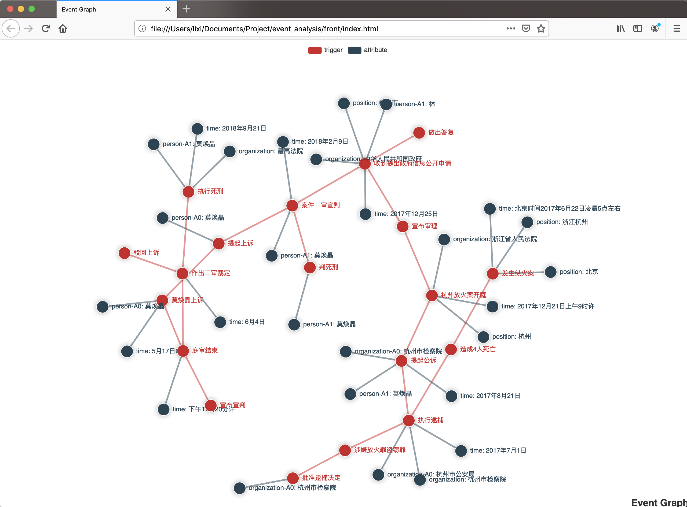

# KGEvetPred

## Introduction
The evolution and development of breaking news events usually present regular patterns, leading to the happening of sequential events. We propose a framework with a pipeline procedure from event extraction to event prediction. Considering the different event domains, we offer a domain-aware event prediction method which has been shown superiority over existing approaches.


This project mainly includes two major tasks:
* Event Evolution Knowledge Graph Generation
* Event prediction


For a detailed description and experimental results, please refer to our paper: [Event prediction based on evolutionary event ontology knowledge](https://www.sciencedirect.com/science/article/pii/S0167739X20311778). 

For the dataset, please refer to: [Evolutionary Event Ontology Knowledge(EEOK)](https://github.com/whxf/EEOK).


## Event Evolution Knowledge Graph Generation

### Description

This task first analyzes the news data, extracts the event chain and event elements from it, and finally generates an event graph.




### Files

* `/corpus`：stores raw data
* `/front`：stores front-end related code
    * more details in [front-end readme.md](front/readme.md)
* `/utils`：stores generation event tools. There are detailed comments in this part of the file, you can directly open the file to view the function description.
    * ltp analyzer 
    * ltp formatter 
    * graph manager 
    * tools 

### Precautions

There are still some imperfections in the event analysis part, and TODO is used to mark the part that can be improved.

## Event prediction

### Description

1. Generate experimental data:
     * In `/corpus` is the generated experimental data
     * `/scripts/make_dataset.ipynb` is the script to generate experimental data
2. Model
     * `/models` contains model documents
     * There are 7 models in total
     * Model training can use `/train.py`
     * `/start.sh` is to use the server to run the model training script
3. Visualization of results
     * `/scripts/draw.py` is a script for visualizing model training results, `/scripts/getscore.py` is a script for obtaining model score data, which is used to assist drawing

### Precautions

1. Create a log folder in the running directory
2. When testing the model (in the model code file) in a single file, you need to comment out the register line

## Others

1. Many files are not uploaded on github, you can find me to copy them directly, please refer to `/.gitignore`
2. The required packages are in `/requirements.txt`
3. `/my_logger.py` is the logger script, and the log is stored in `/log`


## Citation

If this repo helps you, please cite [our paper](https://www.sciencedirect.com/science/article/pii/S0167739X20311778). 

```
@article{MaoLPLHGHW21,
  author    = {Qianren Mao and
               Xi Li and
               Hao Peng and
               Jianxin Li and
               Dongxiao He and
               Shu Guo and
               Min He and
               Lihong Wang},
  title     = {Event prediction based on evolutionary event ontology knowledge},
  journal   = {Future Gener. Comput. Syst.},
  volume    = {115},
  pages     = {76--89},
  year      = {2021},
  url       = {https://doi.org/10.1016/j.future.2020.07.041},
  doi       = {10.1016/j.future.2020.07.041},
  timestamp = {Fri, 18 Dec 2020 10:25:23 +0100},
  biburl    = {https://dblp.org/rec/journals/fgcs/MaoLPLHGHW21.bib},
  bibsource = {dblp computer science bibliography, https://dblp.org}
```
 
